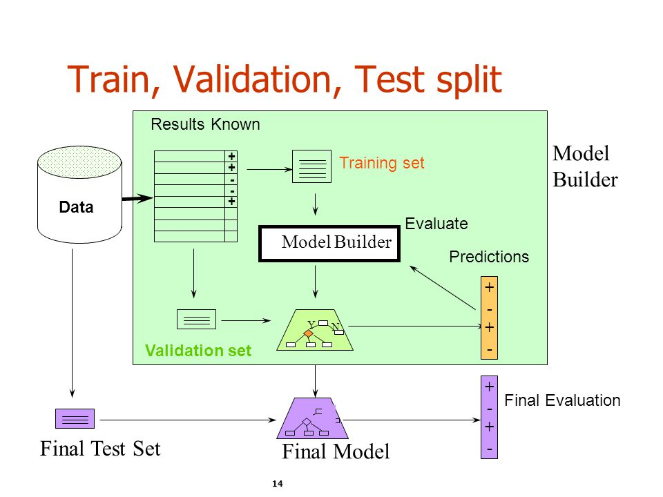
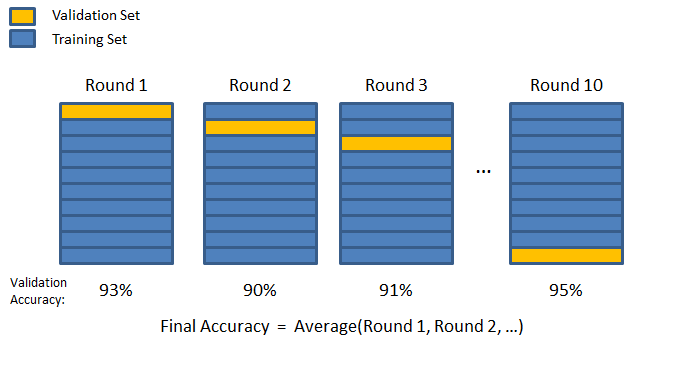

This is an R Markdown document. Markdown is a simple formatting syntax for authoring HTML, PDF, and MS Word documents. For more details on using R Markdown see <http://rmarkdown.rstudio.com>.

When you click the **Knit** button a document will be generated that includes both content as well as the output of any embedded R code chunks within the document. You can embed an R code chunk like this:

```{r ,message=FALSE, echo=FALSE}
#package installation block
library(devtools)
#nice pca
library(ggbiplot)
# Embedded feature selection (ridge, Lasso, Elastic-Net)
library(glmnet)
# Support Vector Machine
library(LiblineaR)
```


# Introduction to Statistics and Machine Learning

- Statistics: inference to obtain valid conclusions from data under various assumptions
- Computer Science: efficient algorithm development, data manipulation
- Intersection $\Rightarrow$ Machine learning: takes the <b><span style="color:#6495ED">past</span></b> data, tries to find some rules, regularities in the data in order to make predictions for the <b><span style="color:#6495ED">future</span></b> observations.
- (*Quizz*) Could you cite examples of Machine Learning applications (outside of your research field)?

## Learn to know your data

First, one needs to load the data set of interest. Usually, data $X$ is made of <b><span style="color:#6495ED">observations</span></b> in row and <b><span style="color:#6495ED">attributes</span></b> in column.
Given the format of your data file, you may choose different `read.` functions (e.g., `read.csv`,`read.table`,...).

<b>Important</b>: for the whole tutorial, we assume that the first column of the data is the response variable ($Y$).

For demonstration purpose, we will use a modified version of a very popular data set: Edgar Anderson's Iris Data (`iris`).

This version of the dataset is based on a collection of 5 measurements (petal/sepal length/width and stem length) obtained on 151 iris flowers, belonging to 3 different species (*setosa, versicolor, virginica*). 

Here, one question could be: 

<b> Given those measurements on a new flower, is it possible to predict its corresponding species ? </b>

```{r }
data <- read.csv('data/iris.csv')
head(data,10)
```
### Descriptive statistics


* Check for predictor with a too <b><span style="color:#6495ED">small variance</span></b>, that might not be helpful.

```{r }
summary(data)
```

* Describe variables variation and univariate analysis to get a sense of what could be the <b><span style="color:#6495ED">important predictors</span></b> and correlation.

```{r }
#'pairs' function does scatterplots for each pair of variables and use labels for color.
pairs(data[2:ncol(data)], main = "Correlation between variables", pch = 21, bg = c("red", "green3", "blue")[unclass(data[,1])])
```

* Here, it seems that the `stem_length` argument is not correlated with iris species. We could decide to exclude this feature from the study.

```{r }
data$stem_length = NULL
```

* It is generally a good idea to check for <b><span style="color:#6495ED">outliers</span></b> in the data (due to typo, technical noise,...) via Principal Component Analysis (<b><span style="color:#6495ED">PCA</span></b>). 
    * This technique is a simple way to represent high-dimensional data in only 2 dimensions.
    * PCA looks for the <b><span style="color:#6495ED"> best linear combination of variables</span></b> to define new variables, encompassing as much variance as possible.
    
```{r }
#separate species name (labels)
labels <- data[,1]
# keep input variables only
obs <- data[,-1]

# 'prcomp' is the Principal Component function in R.
res.pca <- prcomp(obs) 
# See PCA results in summary
print(res.pca)
```
The `Rotation` object contains the Principal Components (PCs) and their coordinates with the original variables.

```{r }
# Plot the 2 first PCs
ggbiplot(res.pca , obs.scale = 1, groups = labels)

```

It seems that we have an outlier belonging to Setosa species. It is preferable to keep it apart from the analysis, while investigating the reason of this measure. 

```{r }
data = data[-1,]
```
NB: Outlier detection is a whole field of research and there is more advanced techniques to test wether or not an observation is an outlier.

This is how it looks <b> after outlier filtering </b>.
```{r ,message=FALSE, echo=FALSE }
#take species name apart
labels <- data[,1]
# keep input variables only
obs <- data[,-1]

# 'prcomp' is the Principal Component function in R.
res.pca <- prcomp(obs) 

# Plot the 2 first PCs
ggbiplot(res.pca , obs.scale = 1, groups = labels)

```

Now that the dataset has been cleaned, it would be easier for us to train our first machine learning model.
We may want to save the pre-processed data set in order to load it easily in the next sessions.

```{r}
write.csv(data,file='data/iris_processed.csv',quote=FALSE,row.names = FALSE)
```
---

## Machine learning

* General definition: <b> you want to find the best model trained on past data that will accurately predict future data. </b>

* Machine learning arose as a subfield of Artificial Intelligence and has a greater emphasis on large scale applications and prediction accuracy.
* Known Machine Learning <b><span style="color:#6495ED"> trade-offs</span></b>:
    * Prediction accuracy versus interpretability: linear models are easy to interpret, but usually are not the best performers
    * Good fit versus overfitting: overfitting the training data decreases the generalization of the model
    * Parsimony versus black-box: number of predictors in the model

## Supervised learning

It refers to the case where your training data are labelled, or have an outcome value already measured.

NB: unsupervised learning is another field where there is not label on the data $\Rightarrow$ clustering.


Applications of supervised learning: 

* Decide which movie you might want to watch next on Netflix,
* Identify the numbers in a handwritten zip code,
* Estimate gene expression level based on multiple SNPs alleles count ([geno2expr](https://github.com/kevinVervier/geno2expr-ML) approach),
* Classify an individual into one of several diagnosis classes, based on multiple phenotypic measurements.

Learning framework: 

* Input/predictor/feature/covariate measurement vector $X$
* Output/response/target measurement $Y$
    * In a <b><span style="color:#6495ED">regression</span></b> problem, $Y$ is a quantitative variable.
    * In a <b><span style="color:#6495ED">classification</span></b> problem, $Y$ takes values in a finite set.
    
(*Quizz*: based on thoses definitions, could you `classify` the previous examples ?) 
    


Based on <b><span style="color:#6495ED">training data</span></b> which are pairs $(xi,yi)$, we are interested in:

1. accurately predicting unseen cases, 
2. assessing the quality of our predictions,
3. understanding which inputs affect the output.

---


## Linear Regression

* Simple approach for supervised learning that assumes a linear dependence between $Y$ and $X$, meaning that there exists constant weights $w_i$ for each predictor, such as $$Y = w_0 + w_1\times X_1 + ... + \epsilon,$$

where $w_0$ represents the bias in the data, and $\epsilon$ is a random noise that is not captured by the predictors.

* This approach works well when $Y$ is a numeric variable, but we will see an alternative approach for qualitative output.
* Although it may seem overly simplistic, linear regression is extremely useful both conceptually and practically.
* Parameters estimation by Residual Sum of Squares (RSS): minimizing residuals between ground truth and fitted values.


 Here, we will change a bit our data set, because the original Iris problem is not a regression one, but a classification problem (see later).
 
 Let say that we are interested in predicting the Sepal length (column 1) of a flower, given the Sepal Width.

```{r }

fit <- lm(sepal_length ~ sepal_width, data = obs) # 'lm' stands for Linear Model.
summary(fit)

```

* To test if there is a significant relationship between one predictor and the outcome, we could compute a statistical test and apply a threshold on the p-value.
    * Fortunately, it is already done in `lm` $\Rightarrow$ look for the stars in the <b> pvalue </b> column (right).
* Accuracy of the fit is measured using $R^2$, also provided by `lm`. It can help for model comparison.
```{r }
# Here, we will consider the 3 variables as predictors.
fit <- lm(sepal_length ~ ., data = obs) # '.' stands for all the other variables 
summary(fit)

```

* *Advanced*: In its simplest version, linear regression does not test correlation between predictors, which could induce confusion when interpreting coefficients (here, Petal length and width).
    * In case of correlation between predictors, it is usually a good idea to consider _interactions_ between features as additional features.
    * There is also non-linear regression methods (e.g. splines or polynomial).

<b> Congrats ! You just trained your first models ! </b>
but...

<b> Meditation break... </b>

* What about the trade-offs we discussed earlier, especially the generalization ? 
* How to evaluate your model performances on future data ?
* How to compare your model performances with other models ?

![<b>Source</b>: An Introduction to Statistical Learning with Applications in R (Fig 2.10). <b>Left</b>:
Data simulated from a function $f$ (almost linear), shown in black. Three estimates of $f$ are shown: the linear regression line (orange curve), and two smoothing spline fits (blue and green curves). <b>Right</b>: Training MSE (grey curve), test MSE (red curve), and minimum possible test MSE over all methods (dashed line). Squares represent the training and test MSEs for the three fits shown in the left-hand panel.](pic/overfit.png)

---

## Model Selection and Regularization

In this section, we will study how to get generalizable models, optimize method parameters and how to evaluate/compare different models.

### Train/Validation/Test sets

* As we saw in the previous picture, it is important to <b> not use the training error </b> as a performance measure (<b><span style="color:#6495ED">overfitting</span></b>)
* The test error is the average error obtained on a new observations set, not used in the training step.
* Hold-out a subset of the training observations from the fitting process and estimate test error on it.
* Here is how to use Train/Validation/Test rule of thumb:
    * Consider 60% of your data for fitting model
    * 20% of the remaining data are used as validation set, especially if there is parameter optimization needed
    * the last 20% of the data are the test/hold-out data, only used when the final model is fitted and estimates test error
    * Main drawback: **need several repeats**, because performances usually depend of the considered random split.
   
 
    
    
```{r }

# Code for a train/validation/test split and evaluation

trainValTestLM <-function(seed = 42){
  set.seed(seed) # fix random seed for reproducible results
  # Generate random index
  idx = sample(c('train','validation','test'),nrow(obs),replace=TRUE,prob = c(0.6,0.2,0.2))
  # Sanity check
  #table(idx)

  # split X
  X.train = obs[which(idx == 'train'),]
  X.val = obs[which(idx == 'validation'),]
  X.test = obs[which(idx == 'test'),]

  # Fit model with only sepal width predictor
  fit1 <- lm(sepal_length ~ sepal_width, data = X.train)
  # Fit model with all predictors
  fit2 <- lm(sepal_length ~ ., data = X.train)

  # Evaluate both models on validation
  preds1 = predict(fit1,X.val)
  preds2 = predict(fit2,X.val)
  
  # One performance measure is the Mean Square Error (MSE) between actual and predicted values:
  # Model 1
  mse1 = mean((X.val[,1] - preds1)^2)
  # Model 2
  mse2 = mean((X.val[,1] - preds2)^2)

  
  #select best model
  if( mse1 < mse2 ){
    best.model = fit1
    best = 1
  }else{
    best.model = fit2
    best = 2
  }
  
  # Do test prediction
  preds.test = predict(best.model,X.test)
  # Get MSE for the test set
  mse.test = mean((X.test[,1] - preds.test)^2)
  #return informations 
  return(list('best.model' = best, 'model1' = fit1, 'model2' = fit2, 'val.perfs.1' = mse1, 'val.perfs.2' = mse2,'test.perfs' = mse.test))
  
}

#Call function for one random seed
results = trainValTestLM(seed = 42)
```

```{r, echo = FALSE}
cat('Model 1 performance on Validation set:',results$val.perfs.1,'\n')
cat('Model 2 performance on Validation set:',results$val.perfs.2,'\n')
cat('Model', results$best.model,'performance on Test set:',results$test.perfs,'\n')

```

```{r}
#Call function for a different seed
results = trainValTestLM(seed = 89)
```

```{r, echo = FALSE}
cat('Model 1 performance on Validation set:',results$val.perfs.1,'\n')
cat('Model 2 performance on Validation set:',results$val.perfs.2,'\n')
cat('Model', results$best.model,'performance on Test set:',results$test.perfs,'\n')

```


Again, you may need to <b> repeat this process </b> (by changing the random seed) to assess model variability as a function of the random split (~50-100X), before applying on test.

### Cross-validation

* An alternative: $K$-fold cross-validation (e.g. $K$ = 5 or 10 or LOO)
    * randomly divide the data into $K$ equal-sized parts.
    * loop for $k$ in 1 to $K$: leave out part $k$ and fit the model to the other $K-1$ combined parts
    * obtain predictions on the $k$-th part
    * get test error estimation by combining all predictions
    * LOO stands for 'Leave-One-Out', where $K$ = `nrow(data)`.
    
 

```{r }
# Code for a cross-validation evaluation
set.seed(42) # fix random seed for reproducible results
# Number of folds/rounds
nfolds = 10
# Generate random index
idx = sample(1:nfolds,nrow(obs),replace=TRUE)
# Sanity check
table(idx)

# Initiate vectors for storing predictions from 2 models
preds1 = rep(0,nrow(obs))
preds2 = rep(0,nrow(obs))

# Loop/Rotation over the different folds
for(fold in 1:nfolds){
  #get index of test fold
  test.idx = which(idx == fold)
  # split train/test
  X.test = obs[test.idx,]
  X.train = obs[-test.idx,]
  # Fit model with only sepal width predictor
  fit1 <- lm(sepal_length ~ sepal_width, data = X.train)
  # Fit model with all predictors
  fit2 <- lm(sepal_length ~ ., data = X.train)

  # Evaluate both models on validation
  preds1[test.idx] = predict(fit1,X.test)
  preds2[test.idx] = predict(fit2,X.test)
}

# In terms of Mean Square Error (MSE) ~ average of residuals
# Model 1
mean((obs[,1] - preds1)^2)
# Model 2
mean((obs[,1] - preds2)^2)

```

---

### Feature selection and Regularization

When dealing with multivariate data, it can be cumbersome to try every possible combination of features in your model.

Good news! There is more systematic ways to select the most meaningful features in your model:

* <b> Filter-based </b> selection: iteratively select the best feature subset, implying that some features are not relevant (basically, follow the stars!)
    * Backward selection starts with all the variables and remove one feature at a time,
    * Forward selection starts with empty model (intercept) and add one feature at a time.

* <b> Embedded/Shrinkage </b> approaches: feature selection during the training step, by regularizing/constraining coefficient estimates towards zero.
    * Idea: minimize a linear regression with additional constraints on the model
    $$ \min_w \mbox{RSS}(Xw,Y) + \lambda\Omega(w),$$
    where $\Omega(w)$ is a function that has higher value for $w$ not respecting the constraints,
    and $\lambda$ is a constant that controls the trade-off between the fit and the constraints.
    * Ridge regression ($L2$): keep all coefficients in the same range, but no selection ($\Omega(w) = \sum_i w_i^2$)
    * Lasso ($L1$): force some of the coefficients to be equal to 0 $\Rightarrow$ sparse model ($\Omega(w) = \sum |w_i|$)
    * Elastic-Net ($L1 + L2$): combination of ridge and Lasso, leading to sparse model and better handling correlated predictors $\Rightarrow$ $\Omega(w) = (1-\alpha)\times\mbox{Ridge} + \alpha\times\mbox{Lasso}$.
    * *Advanced*: regularization is a research field, where one creates new set of constraints, based on known structure in the data (e.g., Group Lasso)


(*Quizz*: shape of the elastic-net "ball" for $\alpha=0.5$?)


Here is an example of cross-validation evaluation that deals with feature selection <b> and </b> parameter optimization (here, $\alpha$ and $\lambda$), using `glmnet` package.

```{r }
# Code for a cross-validation evaluation
set.seed(42) # fix random seed for reproducible results
# Number of folds/rounds
nfolds = 10
# Generate random index
idx = sample(1:nfolds,nrow(obs),replace=TRUE) 

#define alpha parameter
alphas <- seq(from = 0, to = 1, by = 0.01)

#define output
mses <- rep(0,length(alphas))

#loop over alpha values
for(i in 1:length(alphas)){
  # cv.glmnet function does the CV loop for the different folds
  cvfits <- cv.glmnet(x=as.matrix(obs[,-1]), y=obs[,1], alpha=alphas[i], nfolds=nfolds,foldid=idx) 
  # for a given alpha, lambda is optimized inside cv.glmnet
  preds.regul = predict(cvfits, newx = as.matrix(obs[,-1]), s = "lambda.min")
  mses[i] <- mean((obs[,1] - preds.regul)^2)
}
this <- data.frame(mse=mses, alpha=alphas)

plot1 <- ggplot(this, aes(x=alpha, y=mse)) +
  geom_line() +
  ylab("CV mean squared error") +
  xlab("alpha parameter") +
  ggtitle("model error of highest performing regularized elastic-net
           regression as a function of alpha parameter") + 
       #add kitchen sink
          geom_hline(aes(yintercept=mean((obs[,1] - preds2)^2)),
                       size=0.2,linetype = 2)
plot1

#get best model among alpha-range
best.alpha = alphas[tail(which(mses == min(mses)),1)]
#retrain model with best_alpha
cvfits <- cv.glmnet(x=as.matrix(obs[,-1]), y=obs[,1], alpha=best.alpha, nfolds=nfolds,foldid=idx)

# print best parameters pair
cat('Best alpha:',best.alpha,' and best lambda:',cvfits$lambda.min,'\n')
```
Given the small $\lambda$, there is little hope to observe the shrinkage effect, here.

```{r }
#get preds for the best (alpha,lambda) pair
preds.regul = predict(cvfits, newx = as.matrix(obs[,-1]), s = "lambda.min")
# In terms of Mean Square Error (MSE)
# Linear Regression with all variables
mean((obs[,1] - preds2)^2)
# Regularized Model
mean((obs[,1] - preds.regul)^2)

# Check the best Elastic-Net model
coef(cvfits, s = "lambda.min")

# Standard Linear Regression model
coef(fit)

```
This model is slightly different from the Linear Model one, but different enough in terms of performance.

Sometimes regularization is not largely outperforming standard Linear Regression, but it is worth to try it, because, **theoretically it will never do worse**. (*Quizz*: why ?)


## Homework 1 (optional)

When fitting the model for estimating sepal length, we did not use the iris species as a cofactor for the linear model. But is it useful to include it ?

* Plot the sepal length as a function of iris species (*Hint*: boxplot),
* Add dummy (binary) variables to iris dataset that represent species (*Hint*: 2 of them are enough),
* Fit linear model on this new data set (*Hint*: using cross-validation and regularization).
* Demonstrate if the species is an important cofactor to include or not


#Ressources

[(1) Hastie and Tibshirani Online course](http://www.r-bloggers.com/in-depth-introduction-to-machine-learning-in-15-hours-of-expert-videos/)

[An Introduction to Statistical Learning with Applications in R](http://www-bcf.usc.edu/~gareth/ISL/ISLR%20Sixth%20Printing.pdf)

[Introduction to ML with knn applied on iris data](http://www.datacamp.com/community/tutorials/machine-learning-in-r)


