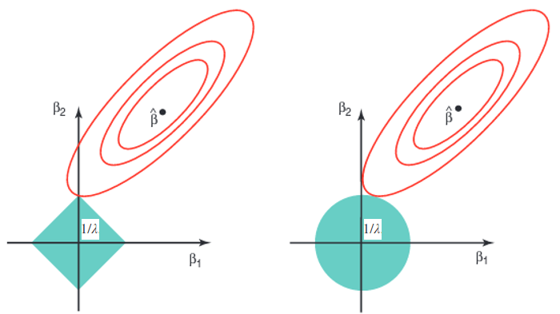

This is an R Markdown document. Markdown is a simple formatting syntax for authoring HTML, PDF, and MS Word documents. For more details on using R Markdown see <http://rmarkdown.rstudio.com>.

When you click the **Knit** button a document will be generated that includes both content as well as the output of any embedded R code chunks within the document.

---


```{r ,message=FALSE, echo=FALSE}
#nice pca
library(ggplot2)
# Embedded feature selection (ridge, Lasso, Elastic-Net)
library(glmnet)
```


# Session 1 debriefing

* Data preparation: non-discriminative variable , outliers, missing data, ...
* Supervised Learning: regression and classification
* Linear Regression
* Overfitting

---

First, we need to load the data we processed during the last session:
```{r }
data <- read.csv('data/iris_processed.csv')
obs <- data[,-1]
```

## Model Selection and Regularization

In this section, we will study how to get generalizable models, optimize method parameters and how to evaluate/compare different models.

### Train/Validation/Test sets

* As we saw in the previous picture, it is important to <b> not use the training error </b> as a performance measure (<b><span style="color:#6495ED">overfitting</span></b>)
* The test error is the average error obtained on a new observations set, not used in the training step.
* Hold-out a subset of the training observations from the fitting process and estimate test error on it.
* Here is how to use Train/Validation/Test rule of thumb:
    * Consider 60% of your data for fitting model
    * 20% of the remaining data are used as validation set, especially if there is parameter optimization needed
    * the last 20% of the data are the test/hold-out data, only used when the final model is fitted and estimates test error
    * Main drawback: **need several repeats**, because performances usually depend of the considered random split.
   
 
    
    
```{r }

# Code for a train/validation/test split and evaluation of two models

trainValTestLM <-function(){
  # Generate random index
  idx = sample(c('train','validation','test'),nrow(obs),replace=TRUE,prob = c(0.6,0.2,0.2))
  # Sanity check
  #table(idx)

  # split X
  X.train = obs[which(idx == 'train'),]
  X.val = obs[which(idx == 'validation'),]
  X.test = obs[which(idx == 'test'),]

  # Fit model with only sepal width predictor
  fit1 <- lm(sepal_length ~ sepal_width, data = X.train)
  # Fit model with all predictors
  fit2 <- lm(sepal_length ~ ., data = X.train)

  
  # Evaluate both models on training (BAD)
  preds.train1 = predict(fit1,X.train)
  preds.train2 = predict(fit2,X.train)

  # Evaluate both models on validation
  preds1 = predict(fit1,X.val)
  preds2 = predict(fit2,X.val)
  
  # One performance measure is the Mean Square Error (MSE) between actual and predicted values:
  
  #### train ####
  # Model 1
  mse.train1 = mean((X.train[,1] - preds.train1)^2)
  # Model 2
  mse.train2 = mean((X.train[,1] - preds.train2)^2)
  
  #### validation ####
  # Model 1
  mse1 = mean((X.val[,1] - preds1)^2)
  # Model 2
  mse2 = mean((X.val[,1] - preds2)^2)

  
  #select best model
  if( mse1 < mse2 ){
    best.model = fit1
    best = 1
  }else{
    best.model = fit2
    best = 2
  }
  
  # Do test prediction
  preds.test = predict(best.model,X.test)
  # Get MSE for the test set
  mse.test = mean((X.test[,1] - preds.test)^2)
  #return informations 
  return(list('best.model' = best, 'model1' = fit1, 'model2' = fit2, 'train.perfs.1' = mse.train1, 'train.perfs.2' = mse.train2, 'val.perfs.1' = mse1, 'val.perfs.2' = mse2,'test.perfs' = mse.test))
  
}

#Call function for one random split
results = trainValTestLM()
```

```{r, echo = FALSE}
cat('Model 1 performance on Train set:',results$train.perfs.1,'\n')
cat('Model 1 performance on Validation set:',results$val.perfs.1,'\n')

cat('Model 2 performance on Train set:',results$train.perfs.2,'\n')
cat('Model 2 performance on Validation set:',results$val.perfs.2,'\n')


cat('Best model (', results$best.model,') performance on Test set:',results$test.perfs,'\n')

```

```{r}
#Call function for a different random split --> note the variation in performance measurement
results = trainValTestLM()
```

```{r, echo = FALSE}
cat('Model 1 performance on Train set:',results$train.perfs.1,'\n')
cat('Model 1 performance on Validation set:',results$val.perfs.1,'\n')

cat('Model 2 performance on Train set:',results$train.perfs.2,'\n')
cat('Model 2 performance on Validation set:',results$val.perfs.2,'\n')


cat('Best model (', results$best.model,') performance on Test set:',results$test.perfs,'\n')

```


Again, you may need to <b> repeat this process </b> to assess model variability as a function of the random split (~50-100X).
As a matter of reproducibility, you may want to fix the random seed of your experiments (http://stackoverflow.com/questions/13605271/reasons-for-using-the-set-seed-function).

### Cross-validation

* An alternative: $K$-fold cross-validation (e.g. $K$ = 5 or 10 or LOO)
    * randomly divide the data into $K$ equal-sized parts.
    * loop for $k$ in 1 to $K$: leave out the fold $k$ and fit the model to the other $K-1$ combined parts
    * obtain predictions on the $k$-th fold
    * get cross-validation error estimation by combining all predictions
    * LOO stands for 'Leave-One-Out', where $K$ = `nrow(data)`.
    
 

```{r }
# Code for a cross-validation evaluation

# Number of folds/rounds
nfolds = 10
# Generate random index
idx = sample(1:nfolds,nrow(obs),replace=TRUE)
# Sanity check
table(idx)

# Initiate vectors for storing predictions from 2 models
preds1 = rep(0,nrow(obs))
preds2 = rep(0,nrow(obs))

# Loop/Rotation over the different folds
for(fold in 1:nfolds){
  #get index of test fold
  val.idx = which(idx == fold)
  # split train/test
  X.val = obs[val.idx,]
  X.train = obs[-val.idx,]
  # Fit model with only sepal width predictor
  fit1 <- lm(sepal_length ~ sepal_width, data = X.train)
  # Fit model with all predictors
  fit2 <- lm(sepal_length ~ ., data = X.train)

  # Evaluate both models on validation
  preds1[val.idx] = predict(fit1,X.val)
  preds2[val.idx] = predict(fit2,X.val)
}

# In terms of Mean Square Error (MSE) ~ average of residuals
# Model 1
mean((obs[,1] - preds1)^2)
# Model 2
mean((obs[,1] - preds2)^2)

```

By using one of these approaches, you avoid overfitting and get a fair way to compare model at the same time.

---

### Feature selection

We already checked with `iris` linear regression example that it can be cumbersome to try every possible combination of features in your model.

Good news! There is more systematic ways to select the most meaningful features in your model:

* <b> Backward selection </b> (naive): iteratively select the best feature subset, implying that some features are not relevant (basically, follow the p-values stars!)
  --> it requires you train several models with different subsets of variables (could take long with a large set of input variables).

* <b> Regularization </b> approaches (Section 6.2): feature selection during the training step, by regularizing/constraining coefficient estimates towards zero.
    * Idea: minimize a linear regression with additional constraints on the model
    $$ \min_\beta \mbox{Error}(X,Y,\beta) + \lambda\Omega(\beta),$$
    where $\Omega(\beta)$ is a function that has higher value for $\beta$ not respecting the constraints,
    and $\lambda$ is a constant that controls the trade-off between the fit and the constraints.
    * <b>Ridge</b> regression: keep all coefficients in the same range, but no selection
    * <b>Lasso</b>: force some of the coefficients to be equal to 0 $\Rightarrow$ sparse model
    * <b>Elastic-Net</b>: combination of Ridge and Lasso, leading to sparse model and better handling correlated predictors $$\mbox{Elastic_Net}(\beta) = (1-\alpha)\times\mbox{Ridge}(\beta) + \alpha\times\mbox{Lasso}(\beta).$$
    * *Advanced*: regularization is a research field, where one creates new set of constraints, based on known structure in the data (e.g., Group Lasso)



(*Quizz*: shape of the elastic-net "ball" for $\alpha=0.5$?)


Here is an example of cross-validation evaluation that deals with feature selection <b> and </b> parameter optimization (here, $\alpha$ and $\lambda$), using `glmnet` package.

```{r }
# Code for a cross-validation evaluation

# Number of folds/rounds
nfolds = 10
# Generate random index
idx = sample(1:nfolds,nrow(obs),replace=TRUE) 

#define alpha parameter
alphas <- seq(from = 0, to = 1, by = 0.01)

#define output
mses <- rep(0,length(alphas))

#loop over alpha values
for(i in 1:length(alphas)){
  # cv.glmnet function does the CV loop for the different folds
  cvfits <- cv.glmnet(x=as.matrix(obs[,-1]), y=obs[,1], alpha=alphas[i], nfolds=nfolds,foldid=idx) 
  # for a given alpha, lambda is optimized inside cv.glmnet
  preds.regul = predict(cvfits, newx = as.matrix(obs[,-1]), s = "lambda.min")
  mses[i] <- mean((obs[,1] - preds.regul)^2)
}
this <- data.frame(mse=mses, alpha=alphas)

#get best model among alpha-range
best.alpha = alphas[which.min(mses)]


# figure: alpha parameter impact on perfomances
plot1 <- ggplot(this, aes(x=alpha, y=mse)) +
  geom_line() +
  ylab("CV mean squared error") +
  xlab("alpha parameter") +
  ggtitle("model error of highest performing regularized elastic-net
           regression as a function of alpha parameter") + 
       #add performances for linear regression without regularization
          geom_hline(aes(yintercept=mean((obs[,1] - preds2)^2)),
                       size=0.2,linetype = 2,colour='dodgerblue4') +
       # add best alpha point
          geom_point(aes(x=best.alpha,y=min(this$mse)),color = 'red') +
    geom_text(aes(x = 0.7, y = mean((obs[,1] - preds2)^2)+0.01*mean(range(this$mse)) , label = "Linear model (lambda = 0)"), colour = "dodgerblue4") + theme(legend.position="none")
plot1

#retrain model with best_alpha
cvfits <- cv.glmnet(x=as.matrix(obs[,-1]), y=obs[,1], alpha=best.alpha, nfolds=nfolds,foldid=idx)

# print best parameters pair
cat('Best alpha:',best.alpha,' and best lambda:',cvfits$lambda.min,'\n')

# figure: lambda parameter impact on performances (given alpha = best_alpha)
xlab = "log(Lambda)"
plot.args = list(x = log10(cvfits$lambda), y = cvfits$cvm, 
        ylim = range(cvfits$cvup, cvfits$cvlo), xlab = xlab, ylab = 'Mean Square Error in 10 CV-folds', type = "n",main = paste('Regularization impact for alpha =',best.alpha))

do.call("plot", plot.args)
# function drawing error bars given an upper and lower bounds
error.bars <-function(x, upper, lower, width = 0.02, ...)
{
	xlim <- range(x)
	barw <- diff(xlim) * width
	segments(x, upper, x, lower, ...)
	segments(x - barw, upper, x + barw, upper, ...)
	segments(x - barw, lower, x + barw, lower, ...)
}
error.bars(log10(cvfits$lambda), cvfits$cvup, cvfits$cvlo, width = 0.01, col = "darkgrey")
points(log10(cvfits$lambda), cvfits$cvm, pch = 20, col = "green")
abline(v = log10(cvfits$lambda.min), lty = 2,col = 'red')

```

Those two graphics illustrate why it is important to find the right parameters, before training your final model. And this will be true whatever the learning technique you will use later.

Here, we compare in a more numerical way the gain of applying regularization, compared to standard linear regression.

```{r }
#get preds for the best (alpha,lambda) pair
preds.regul = predict(cvfits, newx = as.matrix(obs[,-1]), s = "lambda.min")
# In terms of Mean Square Error (MSE)
# Linear Regression with all variables
mean((obs[,1] - preds2)^2)
# Regularized Model
mean((obs[,1] - preds.regul)^2)

# Check the best Elastic-Net model
coef.regul = coef(cvfits, s = "lambda.min")

# Standard Linear Regression model
coef.lm = coef(fit2)

cbind(coef.regul,coef.lm)
```
This model is slightly different from the Linear Model one, but different enough in terms of performance.

Sometimes regularization is not largely outperforming standard Linear Regression, but it is worth to try it, because, **theoretically it will never do worse**. (*Quizz*: why ?)


## Homework 2

When fitting the model for estimating sepal length, we did not use the iris species as a cofactor for the linear model. But is it useful to include it ?

* Plot the sepal length as a function of iris species (*Hint*: boxplot),
* Add dummy (binary) variables to iris dataset that represent species (*Hint*: 2 of them are enough),
* Fit linear model on this new data set (*Hint*: using cross-validation and regularization).
* Demonstrate if the species is an important cofactor to include or not


#Ressources

[(1) Hastie and Tibshirani Online course](http://www.r-bloggers.com/in-depth-introduction-to-machine-learning-in-15-hours-of-expert-videos/)

[An Introduction to Statistical Learning with Applications in R](http://www-bcf.usc.edu/~gareth/ISL/ISLR%20Sixth%20Printing.pdf)

[Introduction to ML with knn applied on iris data](http://www.datacamp.com/community/tutorials/machine-learning-in-r)

