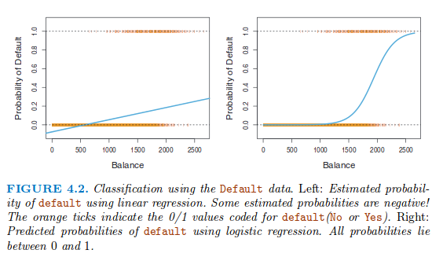
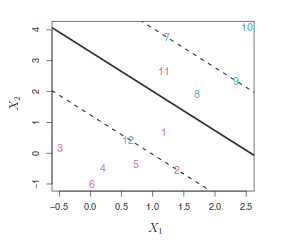
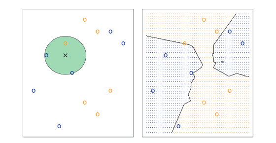
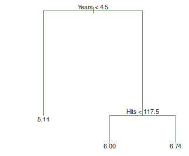
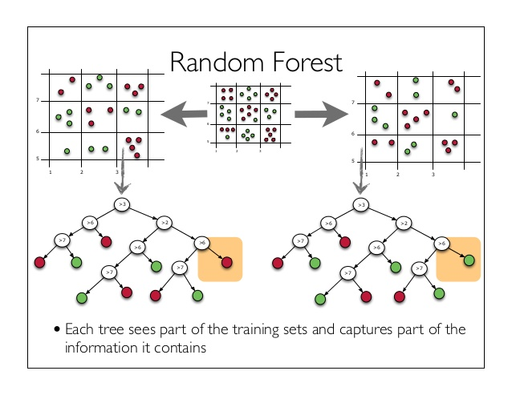

This is an R Markdown document. Markdown is a simple formatting syntax for authoring HTML, PDF, and MS Word documents. For more details on using R Markdown see <http://rmarkdown.rstudio.com>.

When you click the **Knit** button a document will be generated that includes both content as well as the output of any embedded R code chunks within the document. You can embed an R code chunk like this:


```{r ,message=FALSE, echo=FALSE}
#package installation block
library(devtools)
#nice pca
library(ggplot2)
#nice pca
library(ggbiplot)
# Embedded feature selection (ridge, Lasso, Elastic-Net)
library(glmnet)
# Support Vector Machine
library(LiblineaR)
# knn
library(class)
# decision tree
library(rpart)
# Random Forest
library(randomForest)
# performance measures
library(ROCR)
```
# Session 1 (and 1.5) debriefing + homework 

First, we need to load the data we processed during the last session:
```{r }
data <- read.csv('../session1/data/iris_processed.csv')
```

* Plot the sepal length as a function of iris species (*Hint*: boxplot),
```{r}
boxplot(sepal_length ~ species, data = data,xlab='Species',ylab='Sepal length')
# CLearly, there is an effect.
```
* Add dummy (binary) variables to iris dataset that represent species (*Hint*: 2 of them are enough),
```{r}
# initiate
dummy = matrix(0,nrow=nrow(data),ncol=2)
colnames(dummy) = c('isSetosa','isVsericolor')
dummy[which(data$species == 'setosa'),1] = 1
dummy[which(data$species == 'versicolor'),2] = 1
# virginica will be encoded by 0 in both columns

#merge both datasets
data_with_dummy = cbind(data,dummy)
#remove species column (redundant)
data_with_dummy$species = NULL
```

* Fit linear model on this new data set (*Hint*: using cross-validation and regularization).

```{r}
# Code for a cross-validation evaluation

# (Advanced) fix the randomness of the following lines, enable results reproducibility --> getting the same test than last session
set.seed(12345)

# Generate random index
idx.test = sample(c('non-test','test'),nrow(data_with_dummy),replace=TRUE,prob = c(0.8,0.2))

# split observations in test/non-test sets
X = data_with_dummy[which(idx.test == 'non-test'),]
X.test = data_with_dummy[which(idx.test == 'test'),] # this test set will be used for all the evalutations in this session

# Number of folds/rounds
nfolds = 10
# Generate random index
set.seed(42) # same 10-folds than in the previous session
idx = sample(1:nfolds,nrow(X),replace=TRUE)

#define alpha parameter
alphas <- seq(from = 0, to = 1, by = 0.01)

#define output
mses <- rep(0,length(alphas))

#loop over alpha values
for(i in 1:length(alphas)){
   # cv.glmnet function does the CV loop for the different folds
  cvfits <- cv.glmnet(x=as.matrix(X[,-1]), y=X[,1], alpha=alphas[i], nfolds=nfolds,foldid=idx) # for a given alpha, lambda is optimized inside cv.glmnet
  preds.regul = predict(cvfits, newx = as.matrix(X[,-1]), s = "lambda.min")
  mses[i] <- mean((X[,1] - preds.regul)^2)
}
this <- data.frame(mse=mses, alpha=alphas)

#get best model among alpha-range
best.alpha = alphas[which.min(mses)]

# figure of alpha parameter impact
plot1 <- ggplot(this, aes(x=alpha, y=mse)) +
  geom_line() +
  ylab("CV mean squared error") +
  xlab("alpha parameter") +
  ggtitle("model error of highest performing regularized elastic-net
           regression as a function of alpha parameter") + 
       #add performances for regularized model without species information (obtained in session 1_part2)
          geom_hline(aes(yintercept=0.08453256), 
                       size=0.2,linetype = 2,colour='darkorange') +
       # add best alpha point
          geom_point(aes(x=best.alpha,y=min(this$mse)),color = 'darkgreen') +
    geom_text(aes(x = 0.7, y = 0.08453256+0.01*mean(range(this$mse)) , label = "Regularized model (no species info)"), colour = "darkorange") + theme(legend.position="none")
plot1

#retrain model with best_alpha
cvfits <- cv.glmnet(x=as.matrix(X[,-1]), y=X[,1], alpha=best.alpha, nfolds=nfolds,foldid=idx)

# print best parameters pair
cat('Best alpha:',best.alpha,' and best lambda:',cvfits$lambda.min,'\n')

#get preds for the best (alpha,lambda) pair
preds.test = predict(cvfits, newx = as.matrix(X.test[,-1]), s = "lambda.min")
#Check the best model content
coef(cvfits, s = "lambda.min")

# Regularized Model
mean((X.test[,1] - preds.test)^2)
#NB: session 1 best model achieved mse = 0.1370083 on test

```

This concludes Homework 1. Now, Session 2 is about to start !


# Classification methods

* Talking about classification refers to having qualitative response $Y$ that belongs to a finite set of <b>labels/classes</b>.
* Why not Linear Regression ? 
    * Example: Suppose that we are trying to predict the medical condition of a patient in the emergency room on the basis of her symptoms, where there are only three possible diagnoses: *stroke*, *drug overdose*, and *epileptic seizure*. We could consider encoding these values as a quantitative response variable, $Y$, as follows:

$$ \left\{ \begin{array}{ll} 1 & \text{ if stroke,} \\ 2 & \text{ if drug overdose,} \\ 3 & \text{ if epileptic seizure} \end{array}\right.$$

Using this coding, least squares could be used to fit a linear regression model. But unfortunately,
this coding implies an ordering on the outcomes. (*Quizz*) So why linear regression is not a good idea here ? 

So what are the alternative solutions for classification ?
There is <b> two ways of thinking in classification</b>: do you want to predict the class label and/or do you want a estimated probability of this class prediction ?

In the following sections, we will review standard classification algorithms with their own strategy/decision rule. For demonstration purpose, we will apply them to the `iris` data set in its standard use: <b> Is it possible to predict to which species a new flower belongs ?</b>

However, we will keep things simple by considering only the first two classes $\Rightarrow$ **binary classification**.

If your data contains more than two classes, there is multiple ways to extend binary classification to multiclass classification (One-versus-All, One-versus-One, ...). Most of the time, there is additional parameters to provide when you call the function, but the function name remains the same (cf function doc).

```{r}
#only keep the first 2 classes
data = data[which(data$species == 'setosa' | data$species == 'versicolor'),]
# re-define the levels of species column (useful ?)
data$species = factor(data$species)
```

<b>Important</b>: in this session, <b>no cross-validation</b> will be used to find optimal parameters ! It will be your job to implement that in the last session.

## Logistic regression (Chapter 4.3)
* Variation of the Linear Regression for classification purpose.
* Rather than modeling the response $Y$ directly, logistic regression models the probability (from 0 to 1) that $Y$ belongs to a particular category.

$$ \min_\beta \color{red}{\mbox{Error}}(X,Y,\beta) + \color{CornflowerBlue}{\lambda}\color{orange}{\Omega}(\beta),$$
    
where $\mbox{Error}$ has high value if the estimated class probability is wrong.



* Here, we use a similar framework to linear regression, called Generalized Linear Model (`glm`):

```{r}
fit <- glmnet(x=as.matrix(data[,-1]), y=data[,1],family="binomial",alpha = 0.5)
#see coefficients for 1 model
coef(fit)[,7]
# see regularization path
plot(fit,xvar="lambda")
grid()
#add variable name
L <- length(fit$lambda)
x <- log(fit$lambda[L])
y <- fit$beta[, L]
labs <- names(y)
text(x+1, y, labels=labs)

```


## Support Vector Machine (Chapter 9)
* Try to find the best linear separation between classes.
* It is unlikely that your real-world data are perfectly separable.
* SVMs introduce the concept of margin between different classes and cast it in an regularization framework.

$$ \min_\beta \color{red}{\mbox{Error}}(X,Y,\beta) + \frac{1}{\color{CornflowerBlue}{cost}}\color{orange}{\Omega}(\beta),$$
    
where $\Omega(\beta)$ is a function that has higher value for $\beta$ not respecting the constraints,

and $\mbox{Error}$ measures the distance to the margin (if on the <b>wrong side</b>),   

and $cost$ is a constant that controls the trade-off between the fit and the constraints.



* There is different `R` packages for SVM, that rely on subtle variations around the main concept.
* In this tutorial, we will use `LiblineaR` package, where you may want to optimize at least 1 parameter:
    * `cost` determines the trade-off between the margin fit and the misclassification tolerance (high value $\Rightarrow$ more tolerance),
    * Advanced: `type` parameter determines the choice of \color{red}{\mbox{Error}} and \color{orange}{\Omega}. You can for instance do logistic regression, or use a Lasso,
    * Advanced: it is possible to use 'kernel' transformation, when facing data not separable with a linear model (section 9.3.1).
    
```{r}
# standard command
m.svm <- LiblineaR(data=as.matrix(data[,-1]), target=data[,1],cost = 1, type = 2) #type=2 corresponds to the common SVM formulation.
# show model weights
m.svm$W
```

## Nearest neighbours (Section 2.2.3)
* Given a distance measure between training points, it returns label based on $K$ neighbors labels.
* Is not actually training a model: the decision rule is derived from the data with no fit.

* The number of neighbors $K$ considered in the neighborhood is a paramteter to tune,
* Advanced: one may want to consider different metrics than standard Euclidean distance. (not provided by `knn`, requires an home-made function).

```{r}
# DEMO #
set.seed(42)
# define a random training set
sub.train = as.matrix(data[sample(1:nrow(data),100,replace=TRUE),])
# define a random test set
sub.test = as.matrix(data[sample(1:nrow(data),10,replace=TRUE),-1])
# get predictions
knn(train = sub.train[,-1], test = sub.test, cl = sub.train[,1], k = 1)

```


## decision tree (Section 8.1)
* hierarchical organization of decision rules
* prediction via stratification of the feature space $\Rightarrow$ non-linear

* Advanced: may require a pruning phase to avoid overfitting, which is a big issue with this approach...

```{r}
# rpart package
# use the same kind of formula than linear regression
rpart(species~., data=data, method='class')
```

## random forest
* train multiple decision trees by considering random subsampling
* correct single decision tree overfitting issue
* returns label provided by a majority vote of decision trees



* Advanced: here, there is two tunable parameters:
    * `ntree` is the number of trees in the forest
    * `mtry` is the number of variables randomly sampled for each tree
* Advanced: you can measure feature importance in order to filter features

```{r}
# using randomForest package
set.seed(42)
# importance = TRUE is optional
m.rf <- randomForest(species~., data=data, importance=TRUE)
print(m.rf) # nicely overfitted !
# feature importance
importance(m.rf)
```


## Classification performance measures

* With all those new cool approaches, you may wonder which one is the best.
* Problem: 'No free lunch' theorem (Wolpert, 1996)
* For each new data set, you will need to evaluate and compare different approaches (not all of them).
* Here is some useful tools that measure model perfomances in a classification context:
* **Accuracy**: proportion of well-classified test examples
* **True positive rate**: number of class 1 detected as class 1 (class 1 is positive)
* **False positive rate**: number of class 1 detected as class 2 (class 1 is positive)
* **ROC curve**: TPR as a function of FPR, considering different prediction thresholds
* **AUC**: aera under the ROC curve, summarized the curve in one value
* ... (see `ROCR` package documentation)

```{r}
# get predictions for random forest and knn on a random data split (DEMO)
set.seed(42)
idx = sample(1:2,nrow(data),replace=TRUE,prob = c(0.2,0.8))
sub.train = data[which(idx == 1),]
# define a random test set
sub.test = data[which(idx == 2),-1]
# need to be converted in a
test.labels = data[which(idx == 2),1]

#get predictions for decision tree
m.cart <- rpart(species~., data=sub.train, method='class')
pred.cart <- predict(m.cart, newdata = sub.test, type= 'class')
  
# get predictions for random forest
m.rf <- randomForest(y = sub.train[,1], x=sub.train[,-1])
pred.rf <- predict(m.rf, newdata = sub.test, type= "response")

# get accuracy for decision tree
sum(pred.cart == test.labels) / length(test.labels)
# get accuracy for random forest
sum(pred.rf == test.labels) / length(test.labels)
  
#advanced: use ROCR performances (requires predicted class probability, instead of class label)

```


<b> Meditation before concluding... </b>

Choose your data for the last session. If you have no idea on a candidate, we could pick one based on specific points you want to work on.


#Ressources

[(1) Hastie and Tibshirani Online course](http://www.r-bloggers.com/in-depth-introduction-to-machine-learning-in-15-hours-of-expert-videos/)

[An Introduction to Statistical Learning with Applications in R](http://www-bcf.usc.edu/~gareth/ISL/ISLR%20Sixth%20Printing.pdf)

[Introduction to ML with knn applied on iris data](http://www.datacamp.com/community/tutorials/machine-learning-in-r)
